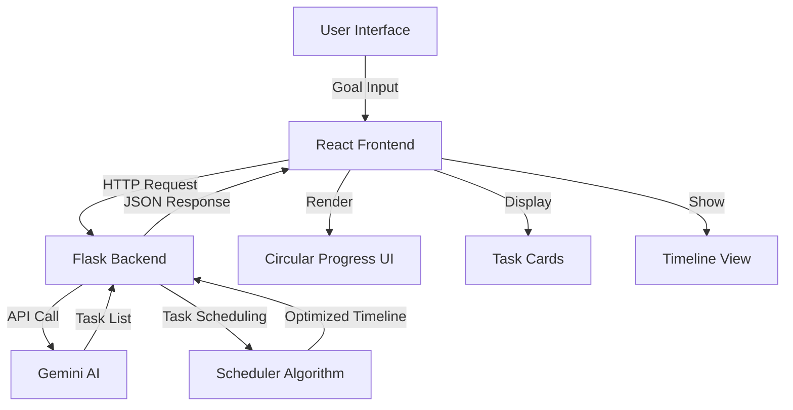

# Smart Task Planner - Technical Architecture

## System Overview



## Component Architecture

### Frontend Layer

#### 1. Main Application (`Index.tsx`)
- Entry point for the application
- Manages state for goal, dates, and results
- Handles API communication
- Orchestrates UI components

**Key Features:**
- Form validation
- Error handling with toast notifications
- Loading states
- Responsive layout

#### 2. Circular Progress Component
**File:** `CircularProgress.tsx`

**Purpose:** Display workflow steps in an animated circular layout

**Algorithm:**
```typescript
// Calculate node position on circle
const angle = (index / totalSteps) * 2 * Math.PI - Math.PI / 2;
const x = centerX + radius * Math.cos(angle);
const y = centerY + radius * Math.sin(angle);
```

**Animations:**
- Node entrance: Scale + fade with stagger
- Active node: Pulsing glow effect
- Progress path: Animated stroke
- Ripple effect: Expanding circles

**Props:**
```typescript
interface CircularProgressProps {
  steps: string[];        // Step labels
  currentStep?: number;   // Current active step
  autoAnimate?: boolean;  // Auto-progress animation
  size?: number;          // Component size in pixels
}
```

#### 3. Task Flow Visualization
**File:** `TaskFlowVisualization.tsx`

**Purpose:** Display tasks in circular formation with connection lines

**Features:**
- Dynamic node positioning
- Connection lines between nodes
- Hover tooltips with task details
- Completion status indicators

**Node States:**
- **Active**: Glowing gradient background, pulse animation
- **Completed**: Check icon, primary color
- **Pending**: Muted colors, outline only

#### 4. Design System
**File:** `index.css`

**Color System (HSL):**
```css
--primary: 262 83% 58%;        /* Purple */
--primary-glow: 262 90% 68%;   /* Light purple */
--accent: 338 100% 63%;         /* Pink */
--success: 142 76% 56%;         /* Green */
```

**Gradients:**
```css
--gradient-primary: linear-gradient(135deg, 
  hsl(262 83% 58%), hsl(262 90% 68%));
--gradient-accent: linear-gradient(135deg, 
  hsl(262 83% 58%), hsl(338 100% 63%));
```

**Custom Animations:**
```css
@keyframes float {
  0%, 100% { transform: translateY(0); }
  50% { transform: translateY(-20px); }
}

@keyframes pulse-glow {
  0%, 100% { opacity: 1; }
  50% { opacity: 0.5; }
}
```

### Backend Layer

#### Flask API Server
**File:** `app.py`

**Endpoints:**

1. **GET /** - Web interface
2. **POST /plan** - Generate task plan

**Request Flow:**
```python
1. Receive goal + parameters
2. Parse dates (today, tomorrow, "in X days/weeks")
3. Call Gemini AI with structured prompt
4. Extract JSON from AI response
5. Run task scheduler
6. Return optimized plan
```

#### Gemini AI Integration

**Model:** `gemini-2.5-flash`

**Prompt Structure:**
```
You are an expert project planner. Given a GOAL, return *only JSON* like:
{
  "tasks": [{
    "id": "T1",
    "name": "Task name",
    "estimated_hours": 5,
    "depends_on": ["T0"]
  }],
  "notes": "Planning insights"
}

GOAL: {user_goal}
START_DATE: {start_date}
DEADLINE: {deadline}
WORK_HOURS_PER_DAY: {hours_per_day}
```

**JSON Extraction:**
```python
def extract_json_safe(text: str) -> dict:
    # Remove markdown code blocks
    text = re.sub(r"^```json|```$", "", text, flags=re.MULTILINE)
    # Extract JSON object
    json_match = re.search(r"\{.*\}", text, re.DOTALL)
    # Parse with error handling
    return json.loads(json_match.group(0))
```

#### Task Scheduler Algorithm

**1. Topological Sort (Dependency Resolution)**
```python
def topo_sort(tasks: List[Dict]) -> List[str]:
    # Build dependency graph
    graph, indeg = build_graph(tasks)
    
    # Start with zero-dependency tasks
    queue = [n for n, d in indeg.items() if d == 0]
    order = []
    
    # Process tasks level by level
    while queue:
        node = queue.pop(0)
        order.append(node)
        for neighbor in graph[node]:
            indeg[neighbor] -= 1
            if indeg[neighbor] == 0:
                queue.append(neighbor)
    
    return order
```

**2. Timeline Optimization**
```python
def schedule_tasks(tasks, start_dt, deadline, work_hours_per_day):
    # Calculate earliest start times (EST)
    est = {}
    for task_id in topological_order:
        deps = task.depends_on
        est[task_id] = max(est[d] + duration[d] for d in deps)
    
    # Check if deadline is feasible
    naive_end = max(est[t] + duration[t] for t in tasks)
    if naive_end > deadline:
        # Compress timeline proportionally
        ratio = available_hours / total_hours
        for task in tasks:
            task.duration *= ratio
    
    return scheduled_tasks
```

**3. Time Compression Formula**
```python
ratio = (deadline - start) * work_hours_per_day / total_task_hours
ratio = max(ratio, 0.25)  # Don't compress below 25%
```

## Data Flow

### 1. User Input → API Request
```javascript
const response = await fetch("http://127.0.0.1:8000/plan", {
  method: "POST",
  headers: { "Content-Type": "application/json" },
  body: JSON.stringify({
    goal: "Launch a product in 2 weeks",
    start_date: "today",
    deadline: "in 2 weeks",
    work_hours_per_day: 6
  })
});
```

### 2. Backend Processing
```
1. Parse input dates
2. Call Gemini AI
3. Parse AI response
4. Sort tasks (topological)
5. Calculate schedule
6. Compress if needed
7. Return JSON
```

### 3. Frontend Rendering
```
1. Receive task data
2. Show TaskFlowVisualization
3. Render task cards
4. Display timeline
5. Animate transitions
```

## Animation System

### Framer Motion Integration

**Sequential Stagger:**
```typescript
animate={{ scale: 1, opacity: 1 }}
transition={{
  delay: index * 0.1,  // 100ms between each item
  duration: 0.6,
  type: "spring"
}}
```

**Infinite Pulse:**
```typescript
animate={{
  scale: [1, 1.15, 1],
  boxShadow: [
    "0 0 20px hsl(var(--primary) / 0.4)",
    "0 0 40px hsl(var(--primary) / 0.6)",
    "0 0 20px hsl(var(--primary) / 0.4)"
  ]
}}
transition={{
  duration: 2,
  ease: [0.45, 0.05, 0.55, 0.95],  // ease-in-out-sine
  repeat: Infinity
}}
```

**Ripple Effect:**
```typescript
<motion.div
  initial={{ scale: 1, opacity: 0.8 }}
  animate={{
    scale: [1, 1.8],
    opacity: [0.8, 0]
  }}
  transition={{
    duration: 1.5,
    ease: "easeOut",
    repeat: Infinity
  }}
/>
```

## Error Handling

### Frontend
```typescript
try {
  const response = await fetch(API_URL, options);
  if (!response.ok) throw new Error(await response.text());
  const data = await response.json();
  setResult(data);
  toast.success("Plan generated!");
} catch (error) {
  console.error(error);
  toast.error(error.message || "Failed to generate plan");
}
```

### Backend
```python
@app.post("/plan")
def plan():
    try:
        # Validate input
        if not goal:
            return jsonify({"error": "Goal required"}), 400
        
        # Generate plan
        result = call_gemini(...)
        return jsonify(result)
        
    except Exception as e:
        return jsonify({"error": str(e)}), 500
```

## Performance Optimizations

### 1. Frontend
- Component memoization with React.memo
- Lazy loading for heavy components
- Debounced input handlers
- Optimized re-renders with proper keys

### 2. Backend
- Cached Gemini responses (optional)
- Efficient graph algorithms (O(V+E))
- Minimal data processing
- CORS pre-flight optimization

### 3. Animations
- Hardware-accelerated transforms
- RequestAnimationFrame timing
- Reduced motion support
- Optimized SVG rendering

## Scalability Considerations

### Current Limitations
- Single-threaded Flask (dev mode)
- In-memory state only
- No authentication
- Limited to 8 visual nodes in circular display

### Production Readiness
**Required Changes:**
1. Use production WSGI server (Gunicorn)
2. Add database for task persistence
3. Implement user authentication
4. Add rate limiting
5. Deploy backend separately
6. Use environment variables for secrets

**Recommended Stack:**
```
Frontend: Vercel/Netlify
Backend: Railway/Render
Database: PostgreSQL/Supabase
AI: Gemini API with key rotation
```

## Security Notes

### API Key Protection
```python
# ❌ Don't commit keys to repo
GEMINI_API_KEY = os.getenv("GEMINI_API_KEY")

# ✅ Use environment variables
if not GEMINI_API_KEY:
    raise ValueError("GEMINI_API_KEY not set")
```

### CORS Configuration
```python
# Development - Allow all
"Access-Control-Allow-Origin": "*"

# Production - Whitelist domains
"Access-Control-Allow-Origin": "https://yourdomain.com"
```

### Input Validation
```python
# Sanitize user input
goal = goal.strip()[:500]  # Max length
if not goal:
    return error_response("Goal required")
```

## Testing Strategy

### Unit Tests
- Task scheduler algorithm
- Date parsing functions
- JSON extraction logic
- Graph topological sort

### Integration Tests
- API endpoint responses
- Gemini AI integration
- End-to-end task generation

### UI Tests
- Component rendering
- Animation timing
- User interactions
- Responsive layouts

## Deployment Checklist

- [ ] Set environment variables
- [ ] Update API URLs for production
- [ ] Enable HTTPS
- [ ] Configure CORS properly
- [ ] Add error monitoring (Sentry)
- [ ] Set up logging
- [ ] Add analytics
- [ ] Test on multiple devices
- [ ] Optimize bundle size
- [ ] Enable caching

---

This architecture provides a solid foundation for a production-ready AI task planning application with beautiful UI and robust backend logic.
